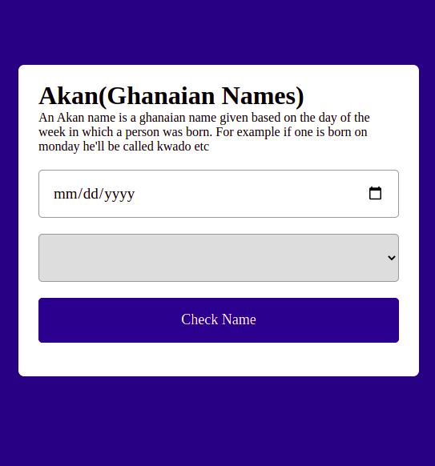

# Akan Names
 ## By Ezra Njeru
## Screenshot
 
 ## Table of Content
 - [Description](#description)
 - [Features](#features)
 - [Requirements](#requirements)
 - [Installation Process](#installation-Process)
 - [Live Link](#Live-Link)
 - [Technology  Used](#technology-Used)
 - [Licence](#licence)
 - [Authors Info](#Authors-Info)
 ## Description
 
This project is a web application  that names users according to their birth day but it has a twist, the names are from ghana 

## Features

As a user of the application,you will be able to :
* choose your birth year
* Select your gender
* Get your ghanaian name from the website after successfull submission.
[Go Back to the top](#Akan-Names)
 ###  Requirements
 * Access to  a computer or any other garget
 * Access to internet
 ### Installation Process
 ****
* Clone to the repo : git clone https://github.com/Ezra-code/Ghanaian-name/tree/master Board
* Unzip the downloaded files in a folder of choice.
* Open the index file from the zipped file with any browser.
 ****
 [Go Back to the top](#Akan-Names)
### Live Link
- Click this link to view the live application https://ezra-code.github.io/Ghanaian-name/
### Technology  Used
* HTML - which was used to develope the structure off the pages.
* CSS - which was used to style the User Interface.
* JavaScript (JS) - was used to make the page responsive
[Go Back to the top](#Akan-Names)
## Instructions
* please fill in all details
## Licence
This project is licensed under the terms of the MIT license
[Go Back to the top](#Akan-Names)
## Authors Info
Ezra Njeru Kithinji 